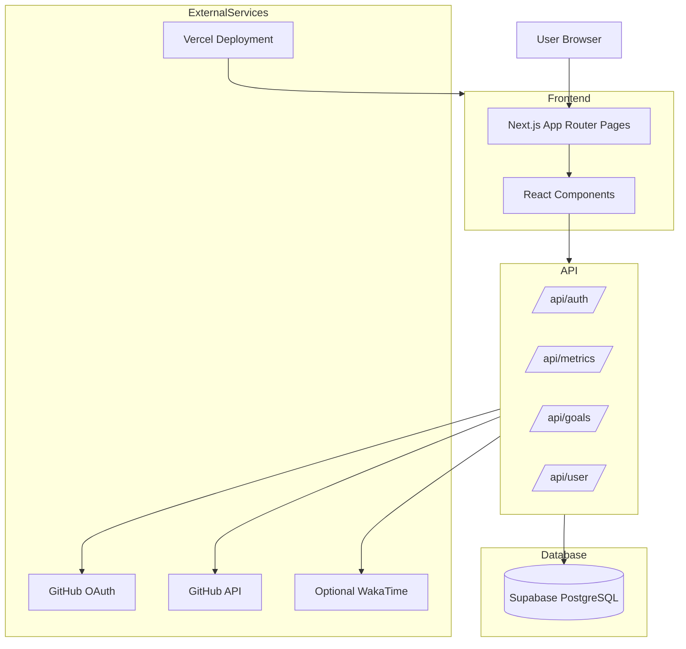

# DevTrack Architecture Overview

This document explains the high-level architecture and data flow of DevTrack.

---

## System Architecture

---

## Frontend Layer

- Built using Next.js App Router
- Uses reusable React components for dashboard widgets
- Tailwind CSS for styling

---

## API Layer

Handles:

- authentication
- GitHub sync
- metrics aggregation
- goals management
- user settings

---

## Database Layer

Supabase PostgreSQL stores:

- users
- goals
- metrics
- streak data
- cached GitHub activity

---

## External Services

### GitHub OAuth

Used for secure authentication.

### GitHub API

Used for:

- commits
- pull requests
- repositories
- contribution activity

### Vercel

Hosts the production deployment.

### WakaTime (optional)

Can provide coding activity metrics.

---

## Data Flow

1. User signs in with GitHub OAuth
2. API fetches GitHub activity
3. Metrics are processed and stored in Supabase
4. Dashboard components fetch and render analytics
